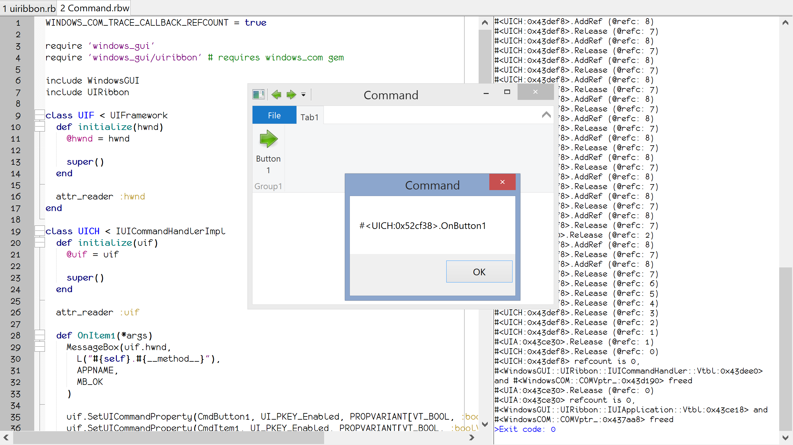

# WindowsCOM

Ruby FFI (x86) bindings to essential COM related Windows APIs



## Features

- convenient DSL for binding COM interface definitions

```ruby
IUIFramework = COMInterface[IUnknown,
  'F4F0385D-6872-43a8-AD09-4C339CB3F5C5',

  Initialize: [[:pointer, :pointer], :long],
  Destroy: [[], :long],
  LoadUI: [[:pointer, :buffer_in], :long],
  GetView: [[:uint, :pointer, :pointer], :long],
  GetUICommandProperty: [[:uint, :pointer, :pointer], :long],
  SetUICommandProperty: [[:uint, :pointer, :pointer], :long],
  InvalidateUICommand: [[:uint, :int, :pointer], :long],
  FlushPendingInvalidations: [[], :long],
  SetModes: [[:int], :long]
]

UIFramework = COMFactory[IUIFramework, '926749fa-2615-4987-8845-c33e65f2b957']

IUIApplication = COMInterface[IUnknown,
  'D428903C-729A-491d-910D-682A08FF2522',

  OnViewChanged: [[:uint, :int, :pointer, :int, :int], :long],
  OnCreateUICommand: [[:uint, :int, :pointer], :long],
  OnDestroyUICommand: [[:uint, :int, :pointer], :long]
]

IUIApplicationImpl = COMCallback[IUIApplication]
```

- straightforward usage of the resulting Ruby classes

```ruby
class UIA < IUIApplicationImpl
  # uich is an instance of IUICommandHandlerImpl subclass (bindings and definition omitted for brevity)
  def initialize(uich)
    @uich = uich

    super() # wire COM stuff
  end

  attr_reader :uich

  # COM interface method implementations

  def OnCreateUICommand(*args)
    uich.QueryInterface(uich.class::IID, args[-1])

    S_OK
  end
end

uif = UIFramework.new # system COM object implementing the IUIFramework interface
uia = UIA.new(uich) # Ruby COM object implementing the IUIApplication interface
```

- transparent interop with code expecting COM interface pointers

```ruby
uif.Initialize(hwnd, uia)
```

## Conventions

Classes starting with capital __I__ are wrappers around __raw COM interface pointers__ inheriting from `COMInterface_` (e.g. `IUIApplication`). They contain `COMVptr_` and `COMVtbl_` (`FFI::Struct` implementations) instances wired to the corresponding COM interface implementation base and virtual table pointers and are (usually) not directly instantiated by application code.

Classes __not__ starting with capital __I__ are __COM factories__ (obtain COM interface implementations using `CoCreateInstance`) inheriting from the corresponding COM interface class (e.g. `UIFramework` is a factory for creating instances of `IUIFramework`). They are directly instantiated by application code and create system COM objects implementing the corresponding interface.

Classes starting with capital __I__ and ending with __Impl__ are __COM callbacks__ inheriting from the corresponding COM interface class (e.g. `IUIApplicationImpl` is a base class for implementing the `IUIApplication` interface in Ruby). They are usually subclassed, implement (some) of the corresponding COM interface methods and then instantiated by application code.

All kinds of classes can be freely subclassed and used regardless of their COM duties (just don't forget to call __super__ appropriately in the subclass `#initialize` method). `COMInterface_` (their common base) implements `#to_ptr` (returning the corresponding `COMVptr_` instance pointer), so the instances can be directly passed to code expecting COM interface pointers. In a scenario where the COM stuff is used as instance variables of some other class, but it is desirable for the class instances to be passed transparently to code expecting COM interface pointers, just define `#to_ptr` calling the appropriate COM object `#to_ptr`.

## Install

gem install windows_com

## Use

See examples folder (the UIRibbon example requires windows_gui gem)
